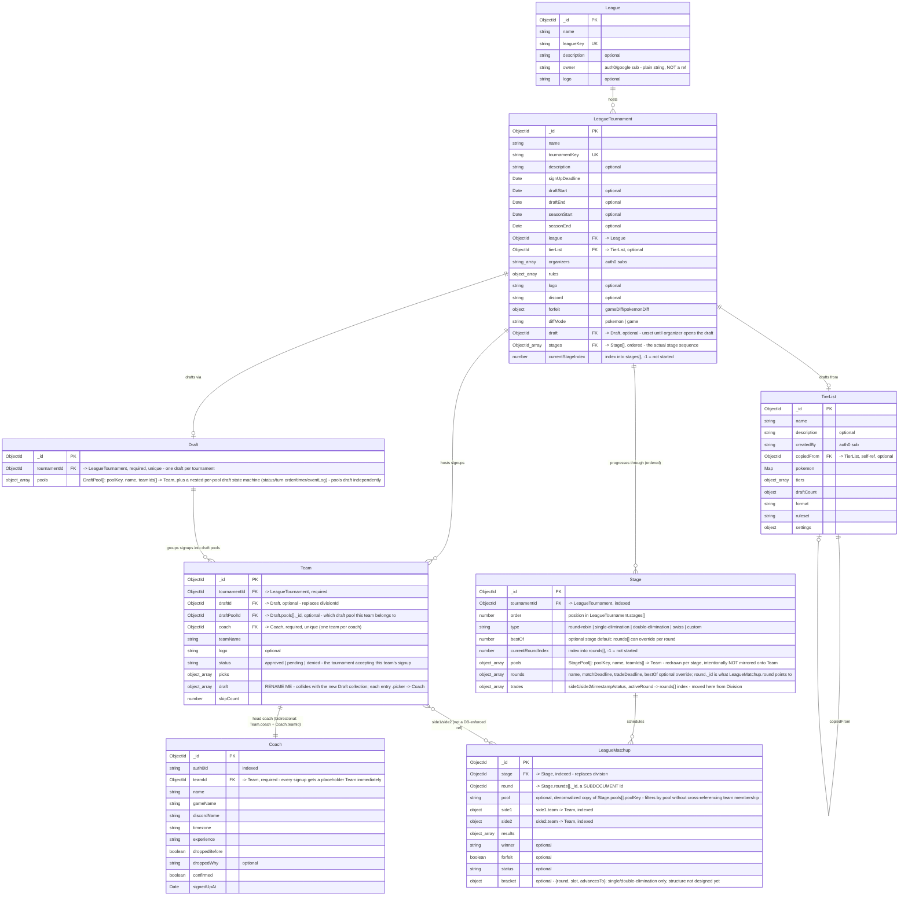

# Proposed league pipeline schema — draft/stage split (sketch)

**Status: sketch for discussion, not implemented.** This builds on
[`league-schema.md`](./league-schema.md) (the current, live schema) and proposes splitting
`Division` into two collections so a tournament can move through an arbitrary, ordered
sequence of formats after the draft — e.g. draft → round-robin pools → bo1/bo2 bracket, or
draft → single swiss pool — without "division" meaning both "draft pool" and "the thing
matchups schedule against" at once.

View with the "Markdown Preview Mermaid Support" VS Code extension, or paste the block into
the [Mermaid Live Editor](https://mermaid.live).

Note: there's deliberately no `Stage ||--o{ Team` line. Division used to own that
relationship via `Team.divisionId`. Pool membership now lives only on
`Stage.pools[].teamIds` — querying "what pool is this team in for this stage" means
`Stage.findOne({ tournamentId, "pools.teamIds": teamId })` rather than reading a field off
`Team`. See below for why.

## What this changes from the current schema

- **`Division` splits into `Draft` and `Stage`.** `Draft` owns draft-time pools and the
  per-pool draft state machine (today's `DivisionDraftEntity`, just relocated and now one
  instance per pool instead of per Division, since pools can draft independently). `Stage`
  owns everything post-draft: format type, rounds, scheduling, trades.
- **`LeagueTournament.stages` becomes load-bearing.** Today `TournamentStageEntity[]`
  is typed (`round-robin | single-elimination | double-elimination | custom`) but
  `LeagueMatchup.round` actually points at `Division.stages[]._id`, which is untyped. This
  proposal makes `LeagueTournament.stages` an ordered list of real `Stage` documents that
  matchups point to directly, closing that disconnect. `swiss` is added to the type enum.
- **`LeagueTournament.playoffs` is removed.** It's just a `Stage` with
  `type: "single-elimination"` (or `"double-elimination"`) now — no need for a separate
  field that only ever held a `teams[]` array.
- **Pool membership is stage-scoped, not a permanent `Team` attribute.** `Team.divisionId`
  becomes `Team.draftId` + `Team.draftPoolId` (the only permanently-fixed grouping — which
  draft/pool a team came from). Round-robin pools, bracket seeding, and swiss's single pool
  all live on `Stage.pools[].teamIds` instead, since they can differ stage to stage.
  Deliberately not mirrored onto `Team`, for the same reason `Coach.teamName`/`.logo`/
  `.status` were deleted in the last migration: two copies of the same fact drift apart.
- **`LeagueMatchup.division` becomes `LeagueMatchup.stage`**, with `round` still a
  subdocument id, now pointing at `Stage.rounds[]._id` instead of `Division.stages[]._id`.
  Added an optional denormalized `pool` field for filtering matchups without joining
  through team membership.

## Naming collision to resolve

`Team.draft` already exists (the per-team pick-order log, `.picker -> Coach`) and will read
very confusingly next to the new top-level `Draft` collection. Rename the `Team` field
before implementing — e.g. `Team.pickLog` or `Team.draftTurns`.

## Deliberately left open

- **Bracket advancement.** How a `LeagueMatchup` winner feeds into the next round's match —
  seeding, byes, double-elimination losers bracket. Sketched a placeholder `bracket` object
  on `LeagueMatchup` above; the real shape needs its own design pass.
- **Swiss pairing.** Round N+1 depends on standings after round N, so swiss rounds can't be
  pre-generated like round-robin/bracket rounds can. That's a service-layer algorithm, not
  a schema concern, but it's the most complex stage type to actually build.
- **Migration sequencing.** This is structural enough (Division splitting into two
  collections, FK renames on `Team` and `LeagueMatchup`) that it likely needs its own
  dry-run backfill script, the same way `migrate-coach-team-division-to-nest.ts` did. It
  should run *after* that existing migration is applied and verified, not concurrently with
  it — running both at once risks reading half-migrated `Division`/`Team` shapes.
- **Per-pool `bestOf` override.** Currently `bestOf` lives on `Stage` and optionally
  `Stage.rounds[]`, not per-pool. Left out for now; revisit if a stage ever needs e.g. one
  pool on bo1 and another on bo3 simultaneously.

## Aside: existing doc may already be stale

`league-schema.md` lists `LeagueTournament.owner` (`"auth0 sub, per-tournament"`), but
`hosted-tournament.schema.ts` has no `owner` field today — only `organizers: string[]`.
Not addressed here since it's outside this proposal's scope, but worth a look next time
that doc gets updated.
