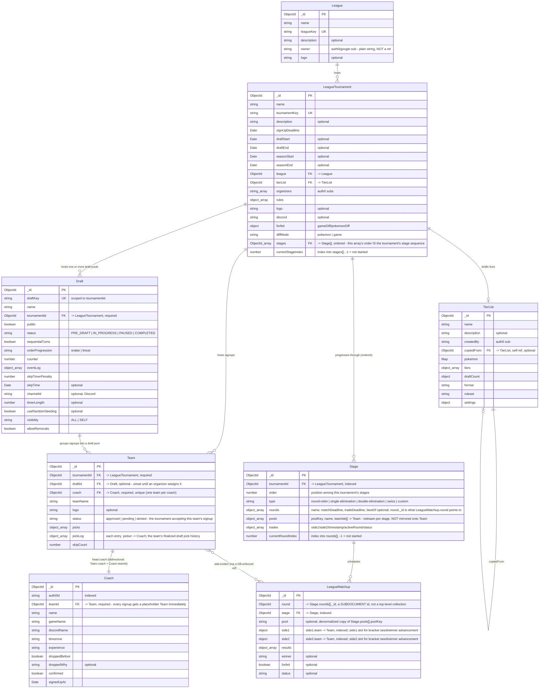

# League pipeline schema map

Hand-built from the actual schema files (not generated). This diagram reflects only the
**NestJS schema** (`src/modules/**/*.schema.ts`) — the target/current shape going forward.

`League`, `LeagueTournament`, and `TierList` are still also defined in
`src/models/league/*.model.ts` (legacy Mongoose, same MongoDB collection, kept in sync by
hand). `Division` _used to_ have that same dual-schema split, but `Division` itself has now
been **removed entirely** — split into `Draft` and `Stage` (see "What changed in this
migration" below). `Coach`, `Team`, `Stage`, `Draft`, and `Matchup` are Nest-only schemas —
see "Migration in progress" below for the transition risk that creates.

View with the "Markdown Preview Mermaid Support" VS Code extension, or paste the block
into the [Mermaid Live Editor](https://mermaid.live) if you don't have it installed.

Note: there's deliberately no `Stage ||--o{ Team` line. Pool membership for a given stage
lives only on `Stage.pools[].teamIds` — querying "what pool is this team in for this stage"
means `Stage.findOne({ tournamentId, "pools.teamIds": teamId })` rather than reading a field
off `Team`.

## What changed in this migration

- **`Division` is gone, split into `Draft` and `Stage`.** A `Division` document used to
  conflate two unrelated things: a fixed pool of teams drafting together (state machine:
  counter, snake/linear order, skip timer), and post-draft round-robin scheduling
  (`stages[]`, `currentStage`, `trades[]`). Because both lived on one document, a team's
  pool membership was permanent for its _entire_ tournament life — no way to redraw pools
  between the draft, a round-robin phase, and a later bracket/swiss phase.
- **`Draft` is a near-1:1 rename of "Division, scoped to draft concerns."** Same
  cardinality as before — one `Draft` document is one pool, and a tournament can have
  multiple simultaneous `Draft` documents (multi-pool drafting), exactly like multiple
  `Division` documents could. The draft state machine fields (`status`/`counter`/
  `orderProgression`/etc., previously the embedded `DivisionDraftEntity`) are now top-level
  fields directly on `Draft`. `Team.draftId` replaces `Team.divisionId` as the one
  permanently-fixed grouping for a team — which draft/pool it came from.
- **`Stage` is the genuinely new concept**: an ordered, per-tournament, typed phase
  (`round-robin | single-elimination | double-elimination | swiss | custom`), each with its
  own `pools[]` (teams can be regrouped independently of which `Draft` they came from),
  `rounds[]`, and `trades[]` (moved here from `Division`, `activeStage` renamed
  `activeRound`). `LeagueTournament.stages` — previously a typed-but-disconnected embedded
  array that nothing actually scheduled against — is now the real ordered list of `Stage`
  refs that `LeagueMatchup` points to.
- **Bracket scheduling was already real and working before this migration** — it just lived
  separately, on `LeagueTournament.stages`/`.playoffs`, with real per-match advancement via
  `LeagueMatchup.side1.slot`/`side2.slot` (`{type: "seed"|"winner", matchId}`). That
  mechanism is preserved exactly; brackets are now just one more `Stage`, alongside
  round-robin and swiss, instead of a separate tournament-level-only mechanism.
  `LeagueTournament.playoffs` (`{teams: ObjectId[]}`) is removed — a playoffs bracket is a
  `Stage` with `type: "single-elimination"` (or `"double-elimination"`) whose `pools[]`
  holds the seeded teams.
- **`Team.draft` is renamed `Team.pickLog`**, to stop colliding with the new top-level
  `Draft` collection name. Same shape (`.pokemon`/`.addons`/`.timestamp`/`.picker`).
- **Pool membership is stage-scoped, not a permanent `Team` attribute.** Round-robin pools,
  bracket seeding, and swiss's single pool all live on `Stage.pools[].teamIds`, never
  mirrored onto `Team` — same reasoning that deleted `Coach.teamName`/`.logo`/`.status` in
  an earlier migration: two copies of the same fact drift apart.
- **`LeagueMatchup.division` is renamed `LeagueMatchup.stage`**, with `round` still a
  subdocument id, now pointing at `Stage.rounds[]._id` instead of `Division.stages[]._id`.
  Added an optional denormalized `pool` field for filtering matchups without joining
  through team membership.

## Migration in progress — transition risk

**The DivisionModule has been deleted** (NestJS controllers/services/repository/schema) —
`src/modules/draft/` and `src/modules/stage/` are now the only server-side path for
draft/scheduling data. However, **the underlying data has not been migrated yet**:
`leaguedrafts`/`leaguestages` are new collections and are currently empty in the live
database. The old `leaguedivisions` collection (and the legacy Express `/leagues` route,
which reads it directly via `src/models/league/division.model.ts` and is allowed to break
per an earlier decision) is untouched and still holds the real, pre-migration data.

Until the migration scripts below are run with `--apply`, any tournament that already has a
real `Division` will have **no corresponding `Draft`/`Stage` documents**, so the new
NestJS `DraftController`/`StageController` endpoints will 404 for it. This was a deliberate,
explicitly-accepted tradeoff (rather than keeping `DivisionModule` around longer) — flagged
here so it isn't mistaken for a bug later.

Two new scripts, both dry-run by default (`--apply` to write), in `src/scripts/`:

- `migrate-division-to-draft-stage.ts` — for each `leaguedivisions` document, creates one
  `Draft` + one `Stage` (type `round-robin`), backfills `Team.draftId`/`Team.pickLog` and
  `LeagueMatchup.stage` (additive only — does not delete `Team.divisionId`/`.draft` or
  `LeagueMatchup.division`, matching every other migration script's "verify before cleanup"
  philosophy). **Must run after** `migrate-coach-team-division-to-nest.ts` (still not yet
  run) is applied and verified.
- `migrate-tournament-stages-to-stage-collection.ts` — run **after** the script above.
  Converts each tournament's already-real embedded bracket `stages[]`/`playoffs.teams` into
  standalone `Stage` documents (preserving round subdocument ids exactly, since
  `LeagueMatchup.round` already points at them), and does the one full rewrite of
  `LeagueTournament.stages` from the old embedded shape into the new ordered `ObjectId[]`
  ref shape — ordering the first script's round-robin `Stage`(s) before its own bracket
  `Stage`, so the final sequence reads draft → round-robin → bracket.

Neither script has been run yet, including in dry-run — that requires connecting to the
shared database (there is no separate staging cluster), which needs explicit sign-off
before being run.
