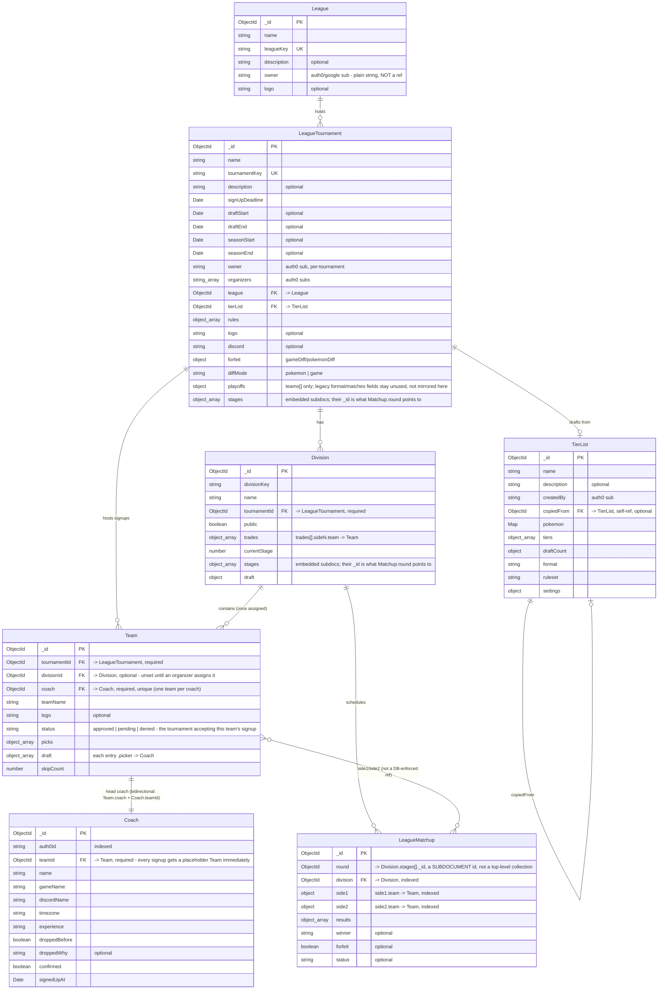

# League pipeline schema map

Hand-built from the actual schema files (not generated). This diagram reflects only the
**NestJS schema** (`src/modules/**/*.schema.ts`) — the target/current shape going forward.

`League`, `LeagueTournament`, and `TierList` are still also defined in
`src/models/league/*.model.ts` (legacy Mongoose, same MongoDB collection, kept in sync by
hand). `Coach`, `Team`, `Division`, and `Matchup` *used to* have that same dual-schema
split, but have now been fully migrated to Nest-only schemas — see "Migration in
progress" below for the transition risk that creates.

View with the "Markdown Preview Mermaid Support" VS Code extension, or paste the block
into the [Mermaid Live Editor](https://mermaid.live) if you don't have it installed.

## What changed in this migration

- **The relationship chain is now `League ← LeagueTournament ← Division ← Team ← Coach`**,
  each child referencing its direct parent, instead of `Division.teams` being the only way
  to know which division a team is in. `Division.teams` is gone; a division's teams are
  `Team.find({ divisionId })`.
- **`Coach.tournamentId` is gone, replaced by `Coach.teamId`.** Signing up now creates a
  placeholder `Team` immediately (status `"pending"`, no `divisionId` yet) alongside the
  `Coach`, rather than only creating a `Team` once an organizer assigns a division.
- **`Coach.teamName` / `.logo` / `.status` are gone** — they live solely on `Team` now.
  These were genuinely duplicated in the legacy schema (both Coach and Team had them,
  with no guaranteed sync between updates to either) — eliminating the Coach copies closes
  that drift risk, not just tidies up redundant fields.
- **`Coach`↔`Team` is intentionally bidirectional**: `Team.coach` (the head coach) and
  `Coach.teamId` both exist, each for a different fast lookup direction. There's no
  `additionalCoaches` array — multi-coach support, if built later, falls out for free by
  having another `Coach` row point its `teamId` at an existing `Team` without becoming
  `Team.coach`. Deliberately not built yet.
- **Fixed `Coach.tournamentId`'s dead ref** (used to declare `ref: "League"`, which matched
  no registered model — now resolved structurally since the field is gone entirely).
- **Fixed the `stage`/`round` field-name bug**: every `LeagueMatchup` query now
  consistently filters by `round` (the schema's real field) instead of the nonexistent
  `stage` key some call sites used.
- **`LeagueTournament.forfeit`/`.diffMode`** are now in the Nest schema (previously
  legacy-only, same gap class as the `league` field bug from earlier this session).

## Migration in progress — transition risk

The underlying MongoDB collections (`leaguecoaches`, `leagueteams`, `leaguedivisions`,
`leaguematchups`) are unchanged — only the schema shape reading/writing them changed. The
legacy Express `/leagues` route and its `services/league-services/*.ts` helpers still read
the *old* field shapes directly off these same collections (`Coach.tournamentId`/
`teamName`/`logo`/`status`, `Division.teams`). Per an explicit decision this session, that
legacy route is allowed to break — it has not been updated and isn't expected to keep
working.

Existing data still has the *old* shape until the backfill migration runs:
`src/scripts/migrate-coach-team-division-to-nest.ts` (dry-run by default, `--apply` to
write) resolves or creates each coach's `Team`, backfills `Team.tournamentId`/`divisionId`,
and sets `Coach.teamId`. It deliberately does not delete the old fields — that's a manual
cleanup step once the new fields are verified. **Not yet run** — run it once ready to cut
over fully to the new shape.
