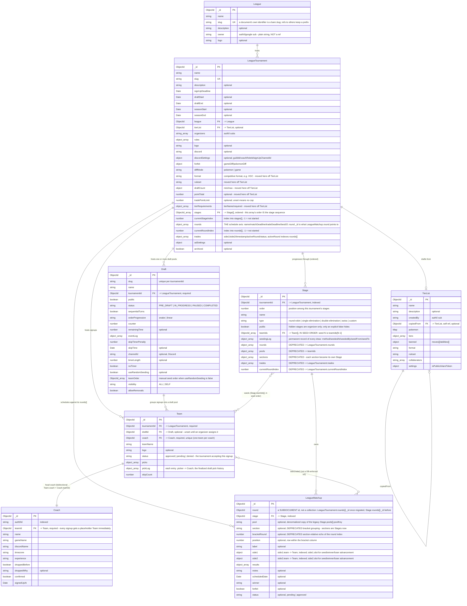

# League pipeline schema map

Hand-built from the actual schema files (not generated), reflecting
`src/modules/**/*.schema.ts`.

The legacy `src/models/league/*.model.ts` Mongoose schemas are **gone** — every collection
here is Nest-only now, and the dual-schema hand-syncing that used to be required with them
is no longer a concern.

View with the "Markdown Preview Mermaid Support" VS Code extension, or paste the block
into the [Mermaid Live Editor](https://mermaid.live) if you don't have it installed.

```mermaid
erDiagram
    League {
        ObjectId _id PK
        string name
        string slug UK "a document's own identifier is a bare slug; refs to others keep a prefix"
        string description "optional"
        string owner "auth0/google sub - plain string, NOT a ref"
        string logo "optional"
    }

    LeagueTournament {
        ObjectId _id PK
        string name
        string slug UK
        string description "optional"
        Date signUpDeadline
        Date draftStart "optional"
        Date draftEnd "optional"
        Date seasonStart "optional"
        Date seasonEnd "optional"
        ObjectId league FK "-> League"
        ObjectId tierList FK "-> TierList, optional"
        string_array organizers "auth0 subs"
        object_array rules
        string logo "optional"
        string discord "optional"
        object discordSettings "optional; guildId/coachRoleId/signUpChannelId"
        object forfeit "gameDiff/pokemonDiff"
        string diffMode "pokemon | game"
        string format "competitive format, e.g. VGC - moved here off TierList"
        string ruleset "moved here off TierList"
        object draftCount "min/max - moved here off TierList"
        number pointTotal "optional - moved here off TierList"
        number tradePointLimit "optional; unset means no cap"
        object_array tierRequirements "tierName/required - moved here off TierList"
        ObjectId_array stages FK "-> Stage[], ordered - this array's order IS the stage sequence"
        number currentStageIndex "index into stages[], -1 = not started"
        object_array rounds "THE schedule axis: name/matchDeadline/tradeDeadline/bestOf; round._id is what LeagueMatchup.round points to"
        number currentRoundIndex "index into rounds[], -1 = not started"
        object_array trades "side1/side2/timestamp/activeRound/status; activeRound indexes rounds[]"
        object adSettings "optional"
        boolean archived "optional"
    }

    Draft {
        ObjectId _id PK
        string slug "unique per tournamentId"
        string name
        ObjectId tournamentId FK "-> LeagueTournament, required"
        boolean public
        string status "PRE_DRAFT | IN_PROGRESS | PAUSED | COMPLETED"
        boolean sequentialTurns
        string orderProgression "snake | linear"
        number counter
        number remainingTime "optional"
        object_array eventLog
        number skipTimerPenalty
        Date skipTime "optional"
        string channelId "optional, Discord"
        number timerLength "optional"
        boolean noTimer
        boolean useRandomSeeding "optional"
        ObjectId_array teamOrder "manual seed order when useRandomSeeding is false"
        string visibility "ALL | SELF"
        boolean allowRemovals
    }

    Stage {
        ObjectId _id PK
        ObjectId tournamentId FK "-> LeagueTournament, indexed"
        number order "position among this tournament's stages"
        string name
        string type "round-robin | single-elimination | double-elimination | swiss | custom"
        boolean public "hidden stages are organizer-only; only an explicit false hides"
        ObjectId_array teamIds FK "-> Team[], IN SEED ORDER: seed N is teamIds[N-1]"
        object_array seedingLog "permanent record of every draw: method/seededAt/seededBy/seedFrom/seedTo"
        object_array rounds "DEPRECATED -> LeagueTournament.rounds"
        object_array pools "DEPRECATED -> teamIds"
        object_array sections "DEPRECATED - each section became its own Stage"
        object_array trades "DEPRECATED -> LeagueTournament.trades"
        number currentRoundIndex "DEPRECATED -> LeagueTournament.currentRoundIndex"
    }

    Team {
        ObjectId _id PK
        ObjectId tournamentId FK "-> LeagueTournament, required"
        ObjectId draftId FK "-> Draft, optional - unset until an organizer assigns it"
        ObjectId coach FK "-> Coach, required, unique (one team per coach)"
        string teamName
        string logo "optional"
        string status "approved | pending | denied - the tournament accepting this signup"
        object_array picks
        object_array pickLog "each entry .picker -> Coach; the finalized draft pick history"
        number skipCount
    }

    Coach {
        ObjectId _id PK
        string auth0Id "indexed"
        ObjectId teamId FK "-> Team, required - every signup gets a placeholder Team immediately"
        string name
        string gameName
        string discordName
        string timezone
        string experience
        boolean droppedBefore
        string droppedWhy "optional"
        boolean confirmed
        Date signedUpAt
    }

    LeagueMatchup {
        ObjectId _id PK
        ObjectId round "a SUBDOCUMENT id, not a collection: LeagueTournament.rounds[]._id once migrated, Stage.rounds[]._id before"
        ObjectId stage FK "-> Stage, indexed"
        string pool "optional, denormalized copy of the legacy Stage.pools[].poolKey"
        string section "optional, DEPRECATED bracket grouping - sections are Stages now"
        number bracketRound "optional, DEPRECATED section-relative echo of the round index"
        number position "optional, row within the bracket column"
        string label "optional"
        object side1 "side1.team -> Team, indexed; side1.slot for seed/winner/loser advancement"
        object side2 "side2.team -> Team, indexed; side2.slot for seed/winner/loser advancement"
        object_array results
        string notes "optional"
        Date scheduledDate "optional"
        string winner "optional"
        boolean forfeit "optional"
        string status "optional, pending | approved"
    }

    TierList {
        ObjectId _id PK
        string name
        string description "optional"
        string createdBy "auth0 sub"
        ObjectId copiedFrom FK "-> TierList, self-ref, optional"
        Map pokemon
        object_array tiers
        object banned "moves[]/abilities[]"
        string format
        string ruleset
        string_array collaborators
        object settings "isPublic/shareToken"
    }

    League ||--o{ LeagueTournament : "hosts"
    LeagueTournament ||--o{ Draft : "hosts one or more draft pools"
    LeagueTournament ||--o{ Stage : "progresses through (ordered)"
    LeagueTournament ||--o| TierList : "drafts from"
    LeagueTournament ||--o{ Team : "hosts signups"
    LeagueTournament ||--o{ LeagueMatchup : "schedules against its rounds[]"
    Draft ||--o{ Team : "groups signups into a draft pool"
    Stage ||--o{ LeagueMatchup : "owns"
    Stage }o--o{ Team : "seeds (Stage.teamIds[], in seed order)"
    Team ||--|| Coach : "head coach (bidirectional: Team.coach + Coach.teamId)"
    Team }o--o{ LeagueMatchup : "side1/side2 (not a DB-enforced ref)"
    TierList ||--o| TierList : "copiedFrom"
```

## Reading the round axis

A matchup is located by **two** independent references, and both are needed:

- `LeagueMatchup.stage` — which competition it belongs to.
- `LeagueMatchup.round` — **when** it is played, pointing at a round subdocument:
  `LeagueTournament.rounds[]._id` on a migrated tournament, `Stage.rounds[]._id` before
  (see the migration section below). The migration mints fresh ids for the merged axis and
  repoints every matchup through an old-id → new-id map, so this reference is rewritten
  rather than carried over.

Once rounds are tournament-wide, several stages running concurrently share a round and its
deadlines — so a round id alone does **not** identify one stage's matchups.
`findByRoundsInStage(stageId, roundIds)` filters on both; filtering on round alone would
sweep in every other stage's matches.

Slot advancement (`side1.slot`/`side2.slot` = `{type: "seed"|"winner"|"loser", seed,
matchId}`) is deliberately **not** stage-scoped: `slot.matchId` is a matchup `_id`, which
is already unique, and a playoff stage's slots are fed by matches in the group stage
before it.

## Where a stage's teams live

`Stage.teamIds` is an ordered list — **seed N is `teamIds[N - 1]`** — and that positional
meaning is load-bearing. `buildBracketView` numbers seeds by position, so reordering the
array renumbers the whole bracket.

Team membership is stage-scoped and never mirrored onto `Team`: the same reasoning that
removed `Coach.teamName`/`.logo`/`.status` in an earlier migration, since two copies of
one fact drift apart. `Team.draftId` remains the one permanently-fixed grouping (which
draft pool a team came from).

A team may appear in **several** stages, and more than once in a tournament's seed order
overall — each appearance is a separate positional seed.

## Migration in progress: sections → stages

The `Stage` fields marked DEPRECATED above are mid-migration, not dead. A stage used to
own a round axis that its `sections[]` shared; each section owned its own teams, seeding
and standings — all of a stage's responsibilities. So sections became stages, and the axis
they were sharing moved up to the tournament, along with trades (whose `activeRound`
indexes it).

**The data migration was applied to production on 2026-08-01** — every tournament that had
stages (`s3-singles`, `s3-vgc`, `cup-1`) is on the new shape, verified matchup-by-matchup
with `scripts/verify-sections-to-stages.ts`. The legacy fields are still populated and still
read, because the compatibility layer is what makes the rollback meaningful and because
nothing has confirmed the new shape over a full season yet.

Every read therefore still goes through `src/modules/stage/domain/stage-axis.ts` rather than
reaching for one shape or the other:

| Concept | Pre-migration | Post-migration | Resolver |
| --- | --- | --- | --- |
| Round axis | `Stage.rounds` | `LeagueTournament.rounds` | `stageRounds()` |
| Current round | `Stage.currentRoundIndex` | `LeagueTournament.currentRoundIndex` | `currentRoundIndex()` |
| Teams | `Stage.pools[].teamIds` | `Stage.teamIds` | `stageTeamIds()` |
| Trades | `Stage.trades` | `LeagueTournament.trades` | `stageTrades()` |

The tournament wins whenever it has rounds — a stage split out by the migration has none
of its own, and a single-section stage keeps its `_id` and therefore its stale copies.
`usesTournamentAxis()` is the single "has this tournament been converted" signal.

Stage-scoped **writes** to any of the above are refused on a converted tournament
(`STG-007`): the bracket endpoints replace the round list wholesale, so writing from one
stage would renumber every other stage's rounds and orphan their matchups, while a trade
or round advance would silently vanish — the read path prefers the tournament's copy and
would never look at what was just written. Their replacements are tournament-level:
`GET/PATCH /tournaments/:slug/bracket`, `PATCH .../bracket/current-round`,
`GET/POST/PATCH /tournaments/:slug/trades`, and `GET /tournaments/:slug/schedule`.

Scripts (dry-run by default, `--apply` to write), in `scripts/` — note that directory is
gitignored, so these exist only in a working tree:

- `migrate-sections-to-stages.ts` — unions each tournament's stages' rounds into one axis
  (matching by name so concurrent stages share a row), repoints every matchup's `round`,
  splits each stage into one stage per section, and moves trades up remapping
  `activeRound`. Deletes nothing: originals keep `rounds`/`pools`/`sections`/`trades`, and
  a stage split into several is archived (`tournamentId` removed so it stops appearing as
  a phantom stage, `migratedTournamentId` added) rather than dropped.
- `rollback-sections-to-stages.ts` — restores from those retained fields.

## History: Division → Draft + Stage

Completed; scripts live in `scripts/complete/`. Kept here because the shape above only
makes sense against what it replaced.

- **`Division` was split into `Draft` and `Stage`.** One `Division` conflated a fixed pool
  of teams drafting together (counter, snake/linear order, skip timer) with post-draft
  scheduling (`stages[]`, `currentStage`, `trades[]`). Because both lived on one document,
  a team's pool membership was fixed for its _entire_ tournament life — pools could not be
  redrawn between the draft, a round-robin phase, and a later bracket.
- **`Draft` is a near-1:1 rename of "Division, scoped to draft concerns."** Same
  cardinality: one `Draft` is one pool, and a tournament can have several. The draft state
  machine fields are now top-level. `Team.draftId` replaced `Team.divisionId`.
- **`Stage` was the new concept**: an ordered, typed phase per tournament.
  `LeagueTournament.stages` — previously a typed-but-disconnected embedded array — became
  the real ordered list of `Stage` refs.
- **Bracket scheduling already worked before that migration**, on
  `LeagueTournament.stages`/`.playoffs`, with real advancement via `side1.slot`/`side2.slot`.
  That mechanism was preserved exactly; brackets just became one more `Stage`.
  `LeagueTournament.playoffs` was removed.
- **`Team.draft` was renamed `Team.pickLog`**, to stop colliding with the new top-level
  `Draft` collection.
- **`*Key` fields became `slug`** (`leagueKey`/`tournamentKey`/`draftKey` → `slug`).
  A document's own identifier is a bare `slug`; references to another document keep a
  prefix (`leagueSlug`, `tournamentSlug`). ObjectIds were untouched.
- **Format/ruleset/draftCount/pointTotal/tierRequirements moved off `TierList` onto
  `LeagueTournament`**, so several tournaments can share one tier list without sharing its
  competition settings.
